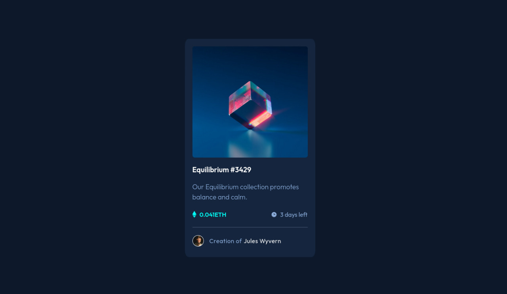

# Frontend Mentor - NFT preview card component solution

This is a solution to the [NFT preview card component challenge on Frontend Mentor](https://www.frontendmentor.io/challenges/nft-preview-card-component-SbdUL_w0U). Frontend Mentor challenges help you improve your coding skills by building realistic projects. 

## Table of contents

- [Screenshot](#screenshot)
- [Links](#links)
- [Built with](#built-with)
- [Author](#author)

### Screenshot

### Links

- Solution URL: https://www.frontendmentor.io/solutions/nft-card-using-html-rqiaY855z
- Live Site URL: https://kiruanime2003.github.io/nft-preview-card-component-main

### Built with

- Semantic HTML5 markup
- SCSS
- Flexbox

## Author

- Website - [Kiruthiga K](https://www.kiruanime2003.gitlab.io)
- Frontend Mentor - [@kiru-dev](https://www.frontendmentor.io/profile/kiru-dev)
